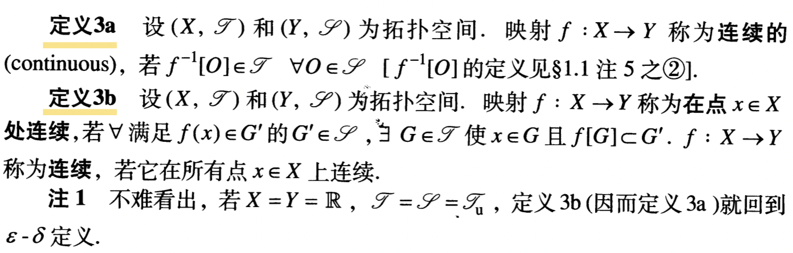
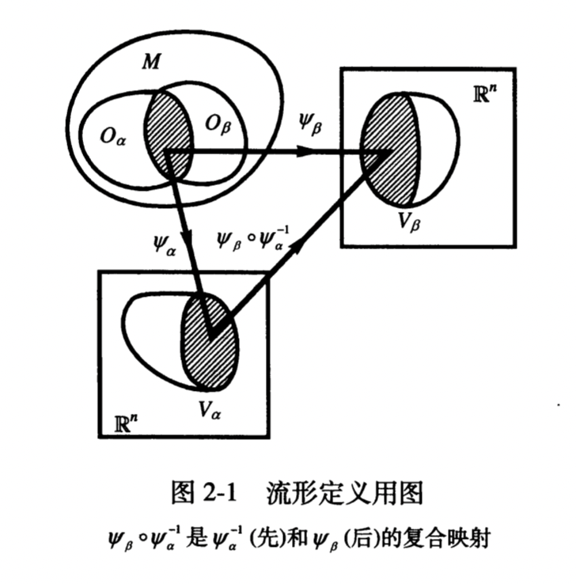
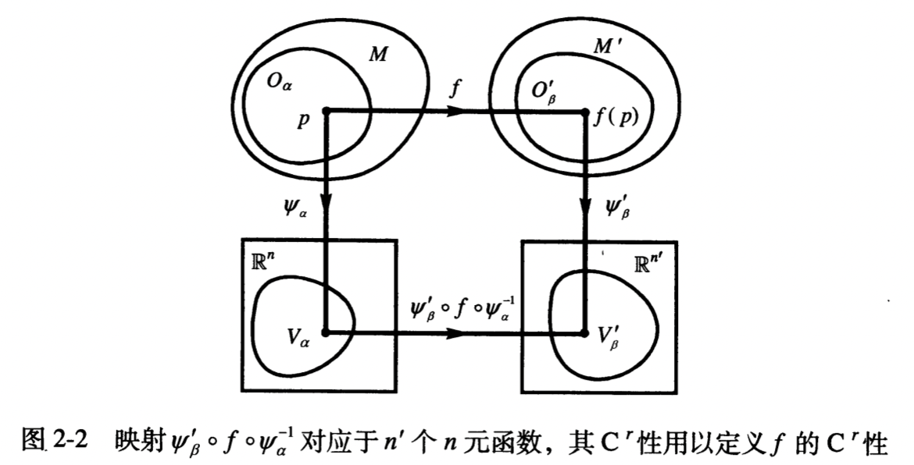
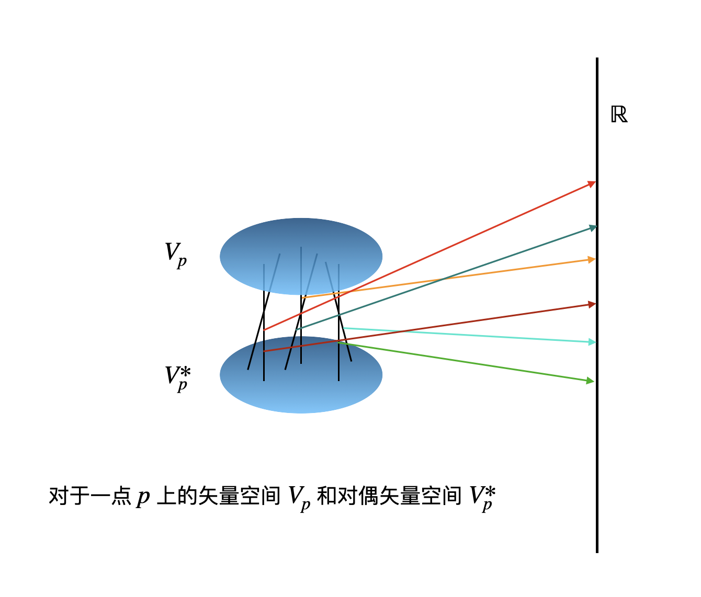

# 几何 张量

为了理解本章节包含的内容都有哪些 列出一些新定义的概念：

1. 集论初步（空集 子集 真子集 集合相等 并集 交集 差集 补集 **卡氏积** 自然坐标 距离 映射 像 原像 定义域 值域 映射相等 一一/单射 到上/满射 常值映射 复合映射 连续性 开子集 ）
2. 拓扑空间（为了定义开子集 给集合赋予了拓扑结构 定义拓扑作为全体开子集的集合 定义拓扑后集合就变成了拓扑空间 诱导拓扑 拓扑子空间 连续 互相同胚 同胚映射 临域 闭集 连通的 闭包 内部 边界 开覆盖）（离散拓扑 凝聚拓扑 通常拓扑 开球 开圆盘 乘积拓扑）
3. 紧致性

1. 微分流形（n维微分流形/n维流形 坐标 坐标系 坐标域 坐标变换 图 平凡流形 微分结构 $C^r$类映射 微分同胚 函数/标量场）
2. 切矢和切矢场（矢量空间 矢量 坐标基底 坐标基矢 坐标分量 矢量变换式 曲线 参数 重参数化 参数方程/参数表达式/参数式 $x^\mu$坐标线 切矢 互相平行 切矢量 切空间）（矢量场 光滑矢量场 对易子 积分曲线 单参微分同胚群与光滑矢量场的对应 轨道）
3. 对偶矢量场（对偶矢量 对偶空间 对偶基底 同构-维数相同 对偶矢量场 光滑的 对偶坐标基底）
4. 张量场
5. 度规张量场
6. 抽象指标记号

任务列表：

使用git更新到GitHub

为每个章节添加定义列表 并 添加指向定义内容的超链接

[toc]

## 序

在这一章节中，梁灿彬老先生带领我们大家一起用数学语言做了一幅画，画的是张量场。从铅笔勾勒结构，到画出轮廓，到细节的草稿，再到层层上色，最后擦去铅笔所留下的印记，于是，一幅“抽象指标记号的张量场描述”的画作诞生了。

我所要做的，只是一个更简单、更易于初步理解的，对于（我所认为的）关键内容的学习笔记。

关于这份笔记的先修知识，由于本人的能力有限，恕我无法直接给出，暂时计划根据我个人的学习经验在讲解中逐步产生出来一个相对独立的知识边界，在讲义完成后对其加以说明。

## 引

> 什么是几何？几何是研究对称性。物理研究对称性。
>
> 物理与几何永远无法分割。

在以往学习微积分的过程中，一切都离不开数字，函数是建立在数轴之间的映射，仿佛天生就有了坐标。就好像打印在橡皮膜上的坐标纸、标有数字的橡皮泥立方体可以随便拉伸，数字只是“字面量”，在这些数字背后，有着一套几何的东西，数字只是在它们身上的标记，单纯作为一些名字，这些数字的符号是没有意义的。实数与我们对自然的经验认知具有一定的对应关系，因而便于我们学习，但我们如今要寻求向更高处抽象的东西。数域是一种特定的数学结构，与此相应的，平常的数轴和坐标对应一种特定的几何结构，在这里要探寻和研究的，就是这样一套更高层次的几何结构。

为了摆脱“数字”，试图用集合的理论来研究曾经微积分中的问题。显然，集合是比实数集更为宽泛的概念，如果能说明满足某些条件的集合都与实数集在我们所研究的方面具有完全相同的性质，那么我们就找到了那个更高一层的抽象，数字就变成了仅仅用来衡量的工具。

## 拓扑空间

> 创建面团

集合所要具备的性质，可以通过函数来反映。对于一般的 $X, Y$ 两个集合，期间的映射只能提出“单射”和“满射”两个要求。对于 $\mathbb{R}$ 到 $\mathbb{R}$ 的映射，即函数，还可以提出连续这一更高的要求，这其实是因为集合 $\mathbb{R}$ 中指定了某种特殊的结构。

连续性的 $\varepsilon-\delta$ 定义可以等价的用开区间概念（而无需距离概念）重新表述如下：设 $X=Y=\mathbb{R} $ ，映射 $f: X\to Y$ 叫做连续的，若 $Y$ 中任一开区间的逆像都是 $X$ 的开区间之并。

其中 $\mathbb{R}$ 的开子集的本质抽象（因而可推广到任意集合）的性质：(a) $\mathbb R$ 和空集 $\varnothing$ 是开子集；(b) 有限个开子集之交仍是开子集；(c) 任意个开子集之并仍是开子集。

于是可以对任意的集合定义开子集。定义连续性并不是开子集的唯一作用，由开子集的概念出发可以定义许多概念证明许多定理，从而发展为一门完整丰富的学科分支——点集拓扑学。

满足上述性质的情况下对一个集合定义开子集的方式是唯一的，一旦对任意集合 $X$ 确定了一种开子集的指定方式，就为这个集合赋予了一种附加结构，叫做拓扑结构。更加标准的，更加标准的我们通过定义一个集合的拓扑（开子集的集合）来定义开子集。

**定义1** 非空集合的一个**拓扑(topology)** $\mathscr{T}$ 是 $X$ 的若干子集的集合，并满足：

(a) $X, \varnothing \in \mathscr{T}$ ；

(b) 若  $O_{i} \in \mathscr{T}, i=1,2, \cdots, n$  , 则  $\bigcap_{i=1}^{n} O_{i} \in \mathscr{T}$ (其中  $\bigcap_{i=1}^{n} O_{i}$ 代表这  $n$ 个  $O_{i}$ 之交) ；

(c) 若 $O_{\alpha} \in \mathscr{T} \ \forall \alpha$ ，则 $\bigcup_\alpha O_{\alpha} \in \mathscr{T}$ .

**定义2** 指定了拓扑 $\mathscr{T}$ （开子集）的集合$X$称为**拓扑空间(topological space)**。

通常为明确起见用 $(X, \mathscr{T})$ 代表拓扑空间，若选定的拓扑明确，也可以只用 $X$ 代表拓扑空间。

**定义3** （**映射连续**的两种等价定义，见书）

**定义4** 两个拓扑空间 $(X, \mathscr{T})$ 和 $(Y, \mathscr{S})$ **互相同胚**，若 $\exists$ 映射 $f:\ X\to Y$ 是双射，连续，且逆连续。 这样的映射称为**同胚映射**，简称**同胚(homeomorphism)**。

自然的，很容易接受，同胚是拓扑空间之间映射的最高要求，从纯拓扑学角度看，两个互相同胚的拓扑空间可以视作相等。

#### 总结

1. [*集合间映射连续的定义*]～[*拓扑结构(即开子集的定义)*]密切相关。
2. *集合* + *拓扑结构* = *拓扑空间*。
3. *集合之间双射* + *拓扑结构下映射及其逆连续* = *同胚*。

## 微分流形

> 把面团对应到立方体

之前讲了一个普普通通的集合是怎样通过定义拓扑结构从而变为拓扑空间的，下面我们进一步将满足特殊条件的拓扑空间定义为微分流形。

**定义1** 如果一个拓扑空间 $(M, \mathscr{T})$ 有开覆盖 $\{O_{\alpha}\}$ (i.e. $M=\bigcup_{\alpha} O_{\alpha}$) ，

(a) 开覆盖中每个 $M$ 的开子集都与 $\mathbb{R}^n$ 中的一个开子集间存在同胚映射 $\psi_{\alpha}: O_{\alpha} \rightarrow V_{\alpha}$ ，

(b) 对于 $O_{\alpha} \bigcap O_{\beta} \neq \varnothing$ 复合映射 $\psi_{\beta} \circ \psi_{\alpha}^{-1}$  ($n$个$n$元函数) 是 $\mathrm{C}^{\infty}$ 的(光滑 定义在微积分中早有)，

则称这个拓扑空间称为 **$n$ 维微分流形 ($n$-dimensional differentiable manifold  $n$ 维流形)**。

（物理上通常要求 $M$ 同时是 Hausdorff space和第二可数的，具体定义先不深究）

**定义2** 每个 $\left(O_{\alpha}, \psi_{\alpha}\right)$ 都叫做**图(Chart)**. 

对于一个拓扑空间可以有多组图满足定义1中要求从而是一个微分流形，这些不同的组即图的集合被叫做**图册(atlas)**，不同图册中的图可以并不满足定义1中的(b)（称为**相容性compatibility条件**）。

也就是说，同一图册中的图是相容的，而不同的图册中的图不一定相容，之后我们不妨吧相容的图册都放到一起构成一些最大的图册。不相容的图册代表不同的**微分结构**，把拓扑空间 $M$ 定义为不同的微分流形。

每个图 $\left(O_{\alpha}, \psi_{\alpha}\right)$ 都把 $M$ 中区域 $O_{\alpha}$ 的点通过 $\psi_{\alpha}$  一一对应到 $\mathbb{R}^n$ ，从而赋予自然**坐标**，于是我们说一个 $\left(O_{\alpha}, \psi_{\alpha}\right)$ 构成一个**坐标系**，区域 $O_{\alpha}$ 为**坐标域**，两个不同但坐标域相交的坐标系之间，在坐标域交集中的点可以用不同的坐标表示， $\psi_{\beta} \circ \psi_{\alpha}^{-1}$  ($n$个$n$元函数) 被称为**坐标变换**。

就如同定义拓扑空间后我们要定义拓扑空间之间映射的连续性那样，现在我们要定义流形之间**映射的连续性**。

**定义3** 从一个流形到另一个流形的映射 $f: M \rightarrow M^{\prime}$ 称为 $\mathrm{C}^r$ 类映射，如果对 $\forall p \in M$ ，映射 $\psi_{\beta}^{\prime} \circ f \circ \psi_{\alpha}^{-1}$ 对应的 $n'$ 个 $n$ 元函数是  $\mathrm{C}^r$ 类的。

就如同定义拓扑空间只间映射的连续性后我们要定义拓扑空间之间的等价关系那样，现在我们要定义流形之间的**等价关系**。

**定义4** 微分流形 $M$ 和 $M'$ 称为**互相微分同胚(diffeomorphic to each other)**，若 $\exists f: M \rightarrow M^{\prime}$ ， $f$ 是双射， $\mathrm{C}^{\infty}$ ，且逆 $\mathrm{C}^{\infty}$ 。这样的映射称为**微分同胚映射**，简称**微分同胚(diffeomorphism)**。

自然的，很容易接受，微分同胚是微分流形之间映射的最高要求，两个互相微分同胚的微分可以视作相等。只有维数相等的流形才可能微分同胚。微分流形上每个图的映射都是微分同胚。

#### 总结

1. 这个规律将一次又一次在这一章体现：我们研究的东西总是流形上的，但我们用来衡量和描述的时候常常要借助其在 $\mathbb{R}^n$ 上的对应，即坐标。（比如本节的定义1定义3）

2. 对 $\mathbb{R}^n$ 取 **通常拓扑** $\mathscr{T}_{\mathrm{u}}$ 和全集的恒等映射，

   可以得到 $\left(\mathbb{R}^{n} , \mathscr{T}_{\mathrm{u}}\right)$ 是 **$n$ 维平凡流形**。

3. *拓扑空间* + *一组图册(微分结构)* = *微分流形*

4. 拓扑空间中的元素是没有坐标的，但如果在拓扑空间中建立微分结构从而使其成为微分流形，其中的元素(点)就可以通过图册来获得坐标。

5. 对于任意一个流形，局部的看像 $\mathbb{R}^n$ ，整体上看又可以不同于 $\mathbb{R}^n$ 。

> 3维的比喻：微分流形就是一个面团，把这个面团划分成不同的(可以重叠的)块，这些块可以向标准的带有坐标的立方体中的块建立光滑的一一对应，不同的分块及对应方式，就给面团上的点赋予了不同坐标。

## 矢量和对偶矢量

一个特殊的流形之间的映射为，流形到实数集的映射，即流形中任意一点到一个实数的映射关系。

**定义5**  映射$f:M\to\mathbb R$   称为， **$M$ 上的函数(function on $M$ )** 或 **$M$ 上的标量场(scalar field on $M$ )**。

根据上面对 $\mathrm{C}^r$ 类映射的定义，如果 $f$ 为 $\mathrm{C}^\infty$ 那么称为**$M$ 上的光滑函数**。 $M$ 上全体光滑函数的集合记为 $\mathscr{F}_M$ (有时简记 $\mathscr{F}$ )。

为了不易混淆，我们通常用标量场这个称呼。标量场举例：电势场(从空间坐标到电势 $\mathbb R^3\to\mathbb R$)。

在线性代数或者其他各种地方已经从代数的角度对**实数域上的矢量空间**有了清晰定义。（即在集合中定义两种运算：定义加法的Abel群，定义实数域的数乘：数乘单位元1、数乘与乘法交换律、数与矢量求和的分配结合律）

下面我们想要在几何中寻找矢量和对应的矢量空间。

在三维欧式空间中，矢量是从一点出发的带有方向和长度的箭头，但对于一般流形，我们要找更本质更具一般性便于推广的特性，下面我们通过一个例子来说明，方向导数是一个更本质的特性。

考虑一个已经了解的例子，电场。

1. 【任意一个电势场中的任意一点的电势】沿一个方向的方向导数为这个方向的【电场强度】矢量。

2. 空间(3维)中【任意电势场中的任意一点的电势】沿全部方向的方向导数的集合(也就是这一点的任意【电场强度】矢量，包括0矢量的集合)，是3维矢量空间。

3. 【坐标方向的匀强电场的电势分别】沿坐标方向的方向导数是一组基。

其实方向导数作用在什么上面并不重要，其本身就已经有了矢量的性质。我们尝试把上面3句话中`【...】`的内容删掉，看看会怎么样。

1. 沿一个方向的方向导数为这个方向的矢量。

2. 空间(3维)中沿全部方向的方向导数的集合(也就是这一点的任意矢量，包括0矢量的集合)，是3维矢量空间。

3. 沿坐标方向的方向导数是一组基。

这3句话稍作推广就是我们接下来要阐述的

1. 矢量的定义
2. 证明：矢量空间、矢量空间的维数
3. 坐标基底

下面先给出矢量的定义，再指明矢量空间对应的集合并证明其是一个矢量空间。

前面的求导，更一般的说，是一个线性满足莱布尼茨律的从光滑的标量场的集合 $\mathscr{F}_M$ 到实数集 $\mathbb R$ 的映射。

**定义2** 映射 $v^a:\mathscr{F}_M\to\mathbb R$ 称为点 $p\in M$ 的一个**矢量(vector)**，若 $\forall f,g\in \mathscr{F}_M,\ \alpha,\beta\in\mathbb{R}$ 有 

(a)(线性) $v^a(\alpha f+\beta g)=\alpha v^a(f)+\beta v^a(g)$ ；

(b)(莱布尼茨律)  $v^a(f g)=f|_{p} v^a(g)+g|_{p} v^a(f)$  .

有一组特殊的矢量(从标量场集到实数集的映射)，叫做，标量场在一组坐标下的坐标偏导映射，数学定义如下：

$(e_\mu)^a(f):=\left.\frac{\partial f\circ \psi\left(x^{1}, \cdots, x^{n}\right)}{\partial x^{\mu}}\right|_{p}, \quad \forall f \in \mathscr{F}_{M}$

 在知道含义的情况下，可以简写为 
 $(e_\mu)^a(f):=\left.\frac{\partial f(x)}{\partial x^{\mu}}\right|_{p}, \quad \forall f \in \mathscr{F}_{M}$ 
 。

上面均使用抽象指标记号： $v^a,\,(e_\mu)^a$  。之后我们将一直类似于这样的符号记法，其中小写拉丁字母上标为抽象指标，用来标记矢量，抽象指标用于区分类型而不涉及具体数值；其中小写希腊字母 $\mu$ 为具体指标，不同的值代表不同的矢量。 

**定理2-2-2** 以 $V_p$ 代表流形 $M$ 中 $p$ 点所有的矢量的集合，则 $V_p$ 是矢量空间且 $\mathrm{dim}V_p=\mathrm{dim}M\equiv n$ 。

a. 偏导为线性运算，自然的定义矢量的加法 $\left(v_1^a+v_2^a\right)(f):=v_1^a(f)+v_2^a(f)$ 和数乘$(\alpha v^a)(f):=\alpha \cdot v^a(f)$，定义零元 $\underline{0} \in V_{p}$ 为 $\underline{0}(f)=0,\   \forall f \in \mathscr{F}_{M}$ 。很容易证明 $V_p$ 为矢量空间。

b. 尽管上面矢量的定义看似要求更加宽泛，但数学上可以证明 $\{(e_\mu)^a\}$ 是 $V_p$ 的一个基底，自然 $\mathrm{dim}V_p=\mathrm{dim}M\equiv n$ 。

我们值得了解一个正交性意味的性质，即，对于 $f=\psi^{-1}$ 即函数为 $x^\nu(\nu=1,\dots,n)$ ，显然有 $(e_\mu)^a(x^\nu)=\frac{\partial x^\nu}{\partial x^{\mu}}|_{p}=\delta^\nu_{\;\mu}$ 。

**定义3** 坐标域内任一点 $p$ 的 $\{(e_\mu)^a\}$ 称为 $V_p$ 的一个**坐标基底(coordinate basis)** ，每个 $(e_\mu)^a$ 称为一个**坐标基矢(coordinate vasis vector)** 。 $v^a\in V_p$ 用 $\{(e_\mu)^a\}$ 线性表出为 $v^a=v^\mu(e_\mu)^a$ ，系数 $v^\mu$ 称为 $v^a$ 的**坐标分量(coordinate components)** 。

**定义1** 对一个 $\mathbb R$ 上有限维矢量空间 $V$，可以有线性映射 $w_a:V\to\mathbb R$ 即把矢量映射到实数，称为 $V$ 上的**对偶矢量(dual vector)** ，全体对偶矢量的集合称作对偶空间 $V^*$ 。

 之后我们将一直类似于这样的符号记法，其中小写拉丁字母下标为抽象指标，用来标记对偶矢量，抽象指标用于区分类型而不涉及具体数值.

对偶矢量空间也是矢量空间。

 $V$ 与 $V^*$ 同构，但从$V$ 到 $V^*$ 的同构映射既不唯一也没有特殊的一个，两个空间中各任取一组基底之间进行一一对应就得到一个同构映射。而 $V$ 与 $V^*$ 的对偶空间 $V^{**}$ 之间可以有自然且特殊的一个同构关系，下面考虑一下，

定义仅要求从 $V^{**},V^*,V$ 中分别任取 $u,w,v$ 有 $\ u(w)\in\mathbb R,w(v)\in \mathbb R$ ，对任一个 $v\in V$ 寻找 $v^{**}\in V^{**}$ 与之对应，则自然的可以定义， $v^{**}(w):=w(v)$ .  

太好了，按照这种自然同构关系，$V$ 和 $V^{**}$ 就完全被看作一个空间。那么矢量空间 $V$ 的双重身份，就使得我们对 $v^a\in V$ 和 $w_a\in V^{*}$ 之间的作用变得不分先后，可以直接写作： $w_av^a=v^aw_a\equiv w_a(v^a)=v^a(w_a)$ 

对偶矢量场的实体：微分。函数 $f$ 的微分 $\mathrm{d}f$ ，我们在微积分中有一定的熟悉，其本身没有大小，给定一个矢量就对应函数按照这一点的变化率在这个方向和长度上的变化量，也就是说 $(\mathrm{d}f|_p)_a:V_p\to\mathbb{R}$ . 显然， $\mathrm{d}f$ 是一个对偶矢量。

比较自然的，定义    $(\mathrm{d}f|_p)_a(v^a):=v(f),\quad\forall v\in V_p$ . 

显然也满足莱布尼茨律：$(\mathrm{d}(f g)|_p)_av^a=v^a(fp)=f|_p v^a(g)+g|_p v^a(f)=f|_p(\mathrm{d}g|_p)_a v^a+g|_p(\mathrm{d}f|_p)_a v^a $ 

$v^a$ 任意即， $\mathrm{d}(f g)|_p=f|_p(\mathrm d g)|_p+ g|_p(\mathrm d f)|_p$ .

还记得上面在引入矢量的坐标基矢时提到， $(e_\mu)^a(x^\nu)=\frac{\partial x^\nu}{\partial x^{\mu}}|_{p}=\delta^\nu_{\;\mu}$ ，现在看，即为， $(\mathrm{d}x^\mu)_a(e_\nu)^a=\delta^\mu_{\;\nu}$ ，可见， $\{(\mathrm{d}x^\mu)_a\}$ 正是与坐标基底 $\{(e_\mu)^a\}$ 对应的**对偶坐标基底**。可以换新的记号， $(e^\mu)_a:=(\mathrm d x^\mu)_a$ 。 任一个对偶矢量可以展开： $w_a=w_\mu(e^\mu)_a$ ，其中 $w_\mu=w_a(e_\mu)^a$ 为在该系的坐标分量。 

考虑 矢量坐标基矢的变换，

$(e_\mu)^a(f)=\frac{\partial f'(x'(x))}{\partial x^\mu}|_p=\frac{\partial f'(x'(x))}{\partial x'^\nu}\frac{\partial x'^\nu}{\partial x^\mu}|_p=\frac{\partial x'^\nu}{\partial x^\mu}|_p(e'_\nu)^a(f)$  

换一种写法

$(e_\mu)^a(\mathrm d f)_a=(e_\mu)^a(e'^\nu)_a(e'_\nu)^a(\mathrm d f)_a$ 

例，量子力学的数学中内插一组完备基的操作， $\langle\phi|a\rangle=\Sigma_{a'}\bra{\phi}a'\rangle\langle a'\ket{a}$ ；

于是得到矢量坐标分量的变换，

$v'^\mu=(e'^\mu)_av^a=(e'^\mu)_a(e_\nu)^a(e^\nu)_av^a=(e'^\mu)_a(e_\nu)^a\;v^\mu=\frac{\partial x'^{\mu}}{\partial x^{\nu}}|_{p}\;v^\nu$  

$w_{\nu}^{\prime}=(e^\mu)_a(e'_\nu)^a\;w_\mu=\frac{\partial x^{\mu}}{\partial x^{\prime v}}|_{p} \;w_{\mu}$  

例， $\langle a'|\psi\rangle=\Sigma_{a}\bra{a'}a\rangle\langle a\ket{\psi}$ 。

 

 

#### 总结

1. 流形中一点所有曲线的切向偏导(下面讲述)构成矢量空间
2. 流形中一点所有标量场的微分构成对偶矢量空间
3. 对偶矢量将矢量映射到实数，同时也被矢量映射到实数，即，矢量与对偶矢量作用得到实数。

## 矢量场和对偶矢量场

什么是曲线

切矢

矢量场

从矢量到张量

张量的外积

张量的缩并

 

同一点可以属于不同坐标系的坐标域因此应当可以进行坐标变换，矢量(的分量)变换式

$p$ 为两个坐标系 $\{x^\mu\},\,\{x'^\nu \}$ 的交集中一点， $v^a\in V_p$ ，考虑 $v^a$ 在两个坐标系的坐标分量，有 $v'^\nu=$  

1. 
2. 

